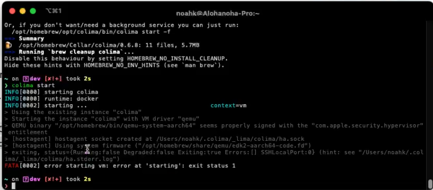

# Docker mit Colima und Homebrew auf macOS

In dieser Anleitung zeige ich dir, wie du Docker mit Colima und Homebrew auf deinem macOS-System installierst. Diese Dokumentation ergänzt mein [YouTube Tutorial](link-zu-deinem-video).
Warum sollte ich Colima anstelle von Docker Desktop benutzen?

## Installation von Docker und Colima

Colima ist ein Ersatz für Docker Desktop und ermöglicht es, Container auf macOS-Systemen auszuführen. ([Quelle](https://apple.stackexchange.com/questions/373888/how-do-i-start-the-docker-daemon-on-macos))

1. Öffne dein Terminal.
2. Installiere Colima und Docker mit Homebrew:

   ```bash
   brew install docker
   docker --version

   brew install colima
   ```

3. Starte Colima:

   ```bash
   colima start
   docker ps -a
   ```

## Verwendung von Docker mit Colima

Nachdem Docker und Colima installiert sind, kannst du Docker-Befehle genauso verwenden, als ob Docker Desktop installiert wäre.

1. Ziehe ein Docker-Image:

   ```bash
   docker pull hello-world
   ```

2. Starte einen Container:

   ```bash
   docker run hello-world
   ```

   Du solltest eine Ausgabe sehen, die eine Willkommensnachricht von Docker enthält.

## Weitere Informationen

Für weitere Informationen zu Docker, Colima und Homebrew, besuche die offiziellen Dokumentationen:

- [Docker Documentation](https://docs.docker.com/)
- [Colima GitHub Repository](https://github.com/abiosoft/colima)
- [Homebrew Documentation](https://docs.brew.sh/)

Wenn du Fragen oder Probleme hast, hinterlasse bitte einen Kommentar unter meinem [YouTube Tutorial](link-zu-deinem-video).

---

Ich hoffe, diese Anleitung war hilfreich! Vielen Dank fürs Anschauen und viel Spaß beim Containerisieren!

## Troubleshooting

Q: Warum startet Colima nicht mit der folgenden Error Meldung?
`FATA [0002] error starting vm: error at 'starting': exit status 1`


A: Lösche den `cd ~/.colima` Verzeichnis und Starte mit Starte Colima mit dem folgenden Befehel

```bash
colima start --arch aarch64
```
